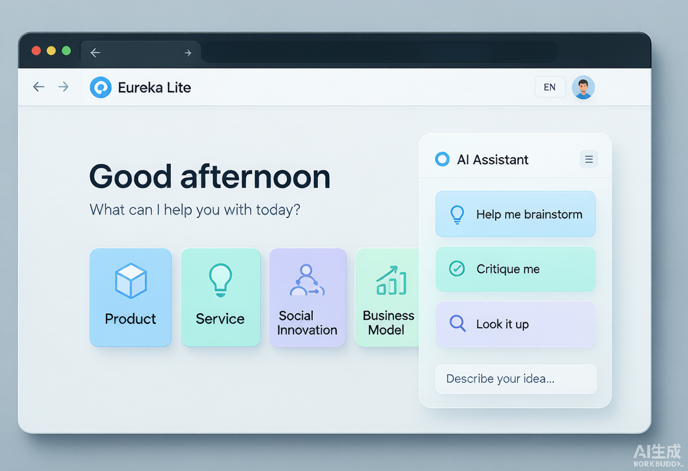
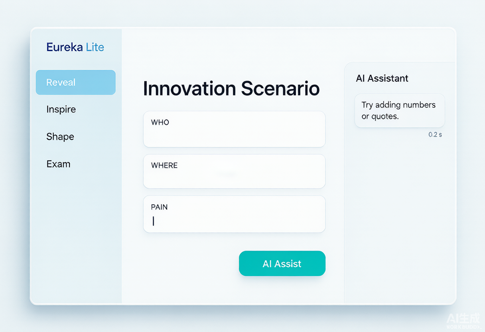
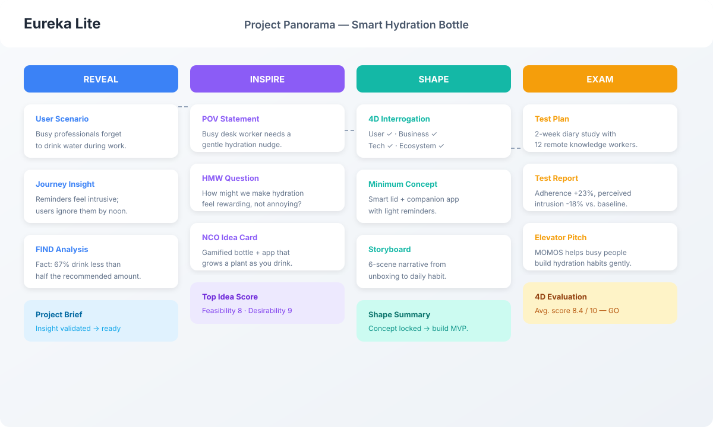
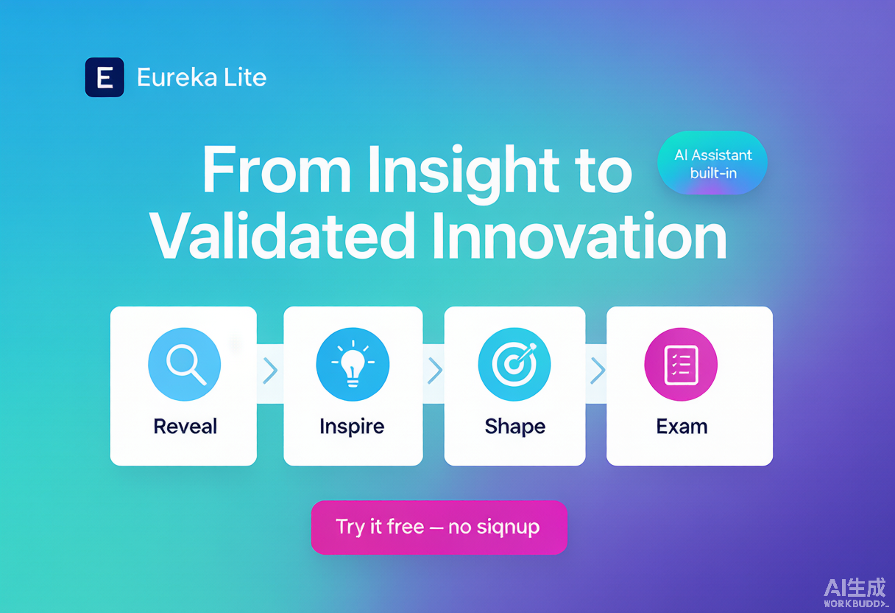

# Eureka Lite — Product Promotion Kit

> **Turn insights into validated innovation, without the template chaos.**

Eureka Lite is a lightweight, AI-assisted innovation workspace that guides individuals and teams through a complete **Reveal → Inspire → Shape → Exam** workflow. It is built for founders, product teams, educators, and consultants who need structure, speed, and a clear path from first observation to validated concept.

**🚀 Live demo:** [https://davidma1973simu.github.io/eureka-lite-en/](https://davidma1973simu.github.io/eureka-lite-en/)

---

## 1. What makes Eureka Lite unique?

| The problem with other tools | How Eureka Lite solves it |
|------------------------------|-----------------------------|
| Scattered docs, sticky notes, and slide decks | One connected workspace with 19 guided screens |
| No clear process from insight to validation | Built-in **RISE methodology** — four stages, end-to-end |
| AI feels like a disconnected chatbot | AI is embedded into every screen as a teammate, not a search box |
| Steep learning curve for beginners | Built-in example project shows the full flow in minutes |
| Signup walls and data lock-in | Runs in the browser, stores locally, no account needed |

### Core differentiators

1. **Methodology-first, not template-first.** Every screen is a deliberate step in a proven innovation flow, not just another blank canvas.
2. **AI is a thinking partner.** Three modes — *Brainstorm*, *Critique*, and *Research* — adapt to where you are in the process.
3. **Visual project panorama.** See your entire innovation story on one page, from user insight to elevator pitch.
4. **Local-first privacy.** Your ideas stay on your device until you decide to share them.

---

## 2. The value in one sentence

**Eureka Lite helps teams ship better ideas faster by giving them a structured innovation workflow and an AI assistant that thinks alongside them — not for them.**

### Key benefits

- **Faster discovery** — The FIND framework and user journey tools surface real needs, not assumptions.
- **Better ideas** — NCO inspiration cards and forced-connection prompts break creative fixation.
- **Sharper concepts** — Four-dimension interrogation exposes blind spots before building.
- **Lower risk** — Test plans and evaluation scoring validate ideas before you invest engineering time.
- **Easier communication** — The panorama view turns complex work into a shareable story.

---

## 3. Target audience

| Audience | Pain point | Why Eureka Lite fits |
|----------|------------|----------------------|
| **Startup founders** | Need to validate an idea before building an MVP | Structured validation flow + elevator pitch output |
| **Product managers & designers** | Running discovery but struggling to connect insights to decisions | RISE stage-by-stage workflow and AI critique |
| **Innovation consultants & facilitators** | Need a reusable tool for workshops | One URL, no install, built-in example |
| **Educators & students** | Teaching design thinking without expensive platforms | Free, browser-based, methodology-driven |
| **Intrapreneurs / R&D teams** | Pressure-testing internal ideas inside a large org | Panorama view makes progress visible to stakeholders |

---

## 4. Use cases

### Use case A: Validate a startup idea in a weekend
A founder sketches a problem, walks through Reveal to pressure-test the user and pain point, generates HMW questions in Inspire, shapes a minimum concept, and writes a test plan in Exam — all in one session.

### Use case B: Run a remote design sprint
A facilitator shares the live URL with a team. The team fills screens together, uses the AI assistant to challenge assumptions, and ends the sprint with a project panorama they can present to leadership.

### Use case C: Teach innovation methods in a classroom
A teacher opens the built-in example project, explains each RISE stage, and asks students to start their own projects. No account setup, no lost files, instant feedback.

### Use case D: Prepare a pitch deck
A product manager uses the four-dimension evaluation and elevator pitch screens to produce a concise, evidence-based narrative for the next investor or executive review.

---

## 5. Screenshots

### Home & AI Assistant
A clean entry point with categories and a built-in AI teammate.

### Guided module workspace
Each RISE stage gives you a focused form, examples, and AI help.

### Project Panorama
See the full innovation journey on one page.

### Share card
Use this visual for social posts, pitch decks, or landing pages.

---

## 6. Call to action

**Try Eureka Lite now:** [https://davidma1973simu.github.io/eureka-lite-en/](https://davidma1973simu.github.io/eureka-lite-en/)

- Open the example project to see RISE in action.
- Start a new project in under 60 seconds.
- Bring your own AI key to supercharge brainstorming and critique.

**Questions or feedback?** Open an issue on GitHub.
